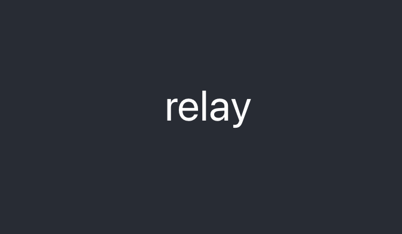

# Relay, React, and hooks

Repo for three sessions on Relay and React: 
* December 16, 2021
* December 17, 2021
* December 21, 2021

(All dates Australian)

This is very much a **test repository**. It will change before class. For now, cloning, installing, and running a quick test with it is all we need to do. 

## Installation

Clone the repository into the directory of your choice. Network drives and excessively deep paths are not recommended.

Having clone the directory, do the following:

```shell
cd relay-react-hooks
npm install
```

While npm is installing, you can set up a or use a GitHub auth token according to the directions [here](https://relay.dev/docs/getting-started/step-by-step-guide/#21-github-graphql-authentication). You only need to complete part 2.1, nothing before, nothing after.  

By this time, npm should have finished installing. Returning to your terminal/command prompt, run `npm start`. Your server should come up on http://localhost:3000. 
It should look something like this:


If you have any trouble, please ask Andre or Liam to get in touch with me. 